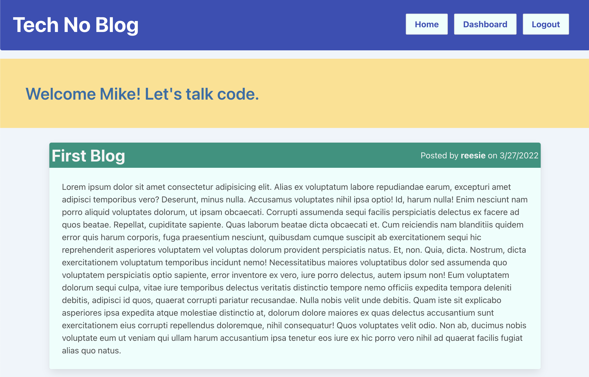

  # tech-no-blog [](http://unlicense.org/)
  
  ## Description
  This is a website where users can see blogs posted on different tech topics. Users can make an account and post their own blogs and comment on other blogs. Users are also able to update and delete their blogs in their dashboard. 
  ## Tables of Contents
  1. [Installation](#installation)
  2. [Usage](#usage)
  3. [Contribution](#contribution)
  4. [Tests](#tests)
  5. [License](#license)
  6. [Questions](#questions)
  ## Installation
  To install the necessary dependencies, run the following command.
  ```
  npm install
  ```
  ## Usage
  You may use the link in this README to access the live deployed site. [Link to site](https://guarded-wildwood-90499.herokuapp.com)
  ## Contribution
  Fork and make a pull request
  ## Tests
  ```
  NA
  ```
  ## License 
  This applicaiton is licensed under the The Unlicense license.
  ## Questions
  If you have any questions:

  [GitHub Acccount](https://github.com/abarragan89)

  Email: anthony.bar.89@gmail.com
